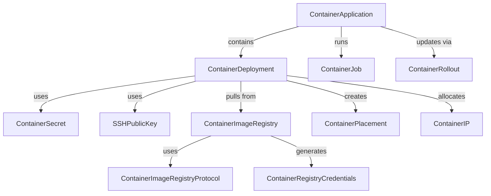

# Cloudflare Containers Resources

This directory contains Alchemy resources for managing containers on Cloudflare's global network. Based on the Cloudflare Containers API, the following resources are available:

## Core Resources

### ✅ ContainerSecret (`secret.ts`)

Manages secrets that can be securely passed to containers as environment variables at runtime without being exposed in the deployment configuration.

### ✅ SSHPublicKey (`ssh-public-key.ts`)

Manages SSH public keys that can be used to access running containers for debugging and administration purposes.

### ✅ ContainerDeployment (`deployment.ts`)

Represents an intent to run a single container with a specific image in a particular location. This is the basic unit of container deployment.

## Application Resources

### ✅ ContainerApplication (`application.ts`)

Represents a group of deployments that can be managed together with scheduling policies, constraints, and affinities. Applications enable:

- Dynamic scheduling across multiple locations
- Scaling policies (instances count)
- Placement constraints (region, city, pop)
- Affinity rules for colocation
- Priority-based scheduling

### ✅ ContainerJob (`job.ts`)

Represents a short-lived container execution within an application. Jobs are:

- Time-bounded executions with configurable timeouts
- One-time runs that complete and clean up
- Useful for batch processing, cron jobs, or event-driven tasks

### ContainerRollout (`rollout.ts`) - To Implement

Manages the progressive deployment of application updates with minimal downtime:

- Step-by-step rollout strategies
- Percentage-based deployments
- Rollback capabilities via update actions
- Manual or automatic progression
- Note: Rollouts are created and deleted, but updates are done via actions (next, previous, revert)

## Registry Resources (To Implement)

### ContainerImageRegistry (`image-registry.ts`)

Manages container image registries that Cloudflare can pull images from:

- Configure private registry authentication
- Support for Docker Hub, GitHub Container Registry, etc.
- Public registry configuration

### ContainerImageRegistryProtocol (`image-registry-protocol.ts`)

Defines protocols that map to multiple registry domains for high availability:

- Create named protocols (e.g., "cf://")
- Map to multiple registry endpoints
- Automatic fallback between registries

### ContainerRegistryCredentials (`registry-credentials.ts`)

Generates temporary credentials for pushing/pulling images to/from Cloudflare's managed registry.

## Infrastructure Resources (To Implement)

### ContainerPlacement (`placement.ts`)

Represents a running instance of a deployment:

- Read-only resource showing container status
- Health and readiness information
- Event history
- Durable object connection status

### ContainerIP (`ip.ts`)

Manages IP address allocations for containers:

- IPv4 and IPv6 allocations
- Port range assignments
- Network mode configurations

## Account Resources (To Implement)

### ContainerAccount (`account.ts`)

Manages container account settings:

- Default configurations (CPU, memory, disk)
- Location limits and availability
- Resource quotas

## Resource Relationships

## Implementation Priority

1. **High Priority** (Core functionality):

   - ✅ ContainerSecret
   - ✅ SSHPublicKey
   - ✅ ContainerDeployment
   - ContainerApplication
   - ContainerImageRegistry

2. **Medium Priority** (Advanced features):

   - ContainerJob
   - ContainerRollout
   - ContainerPlacement

3. **Low Priority** (Supporting resources):
   - ContainerImageRegistryProtocol
   - ContainerRegistryCredentials
   - ContainerIP
   - ContainerAccount

## API Endpoints

All container resources use the base Cloudflare API (`https://api.cloudflare.com/client/v4`) with the `/containers` prefix:

- Secrets: `/containers/secrets`
- SSH Keys: `/containers/ssh-public-keys`
- Deployments: `/containers/deployments/v2`
- Applications: `/containers/applications`
- Jobs: `/containers/applications/{app_id}/jobs`
- Registries: `/containers/registries`
- IPs: `/containers/ips`
- Account: `/containers/me`

## Design Decisions

1. **No Separate API Client**: Uses the standard CloudflareApi from `../api.ts`
2. **Security First**: All secrets must be wrapped in AlchemySecret
3. **Resource References**: Resources can reference each other using either string IDs or resource instances
4. **Immutable Resources**: Some resources like SSH keys are immutable after creation
5. **Lifecycle Management**: All resources properly handle create, update, and delete phases
