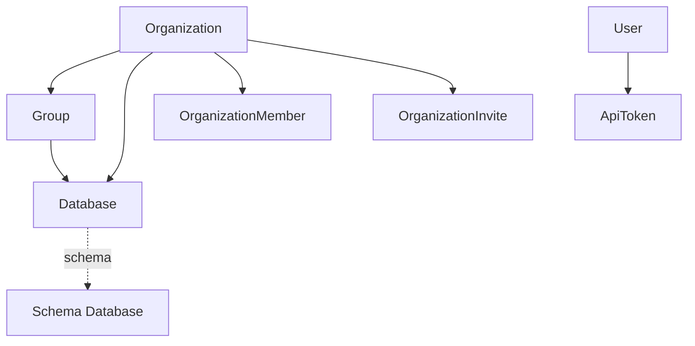

# Turso Provider Design

## Overview

The Turso provider enables Infrastructure-as-Code management of Turso's distributed SQLite database platform. This provider manages databases, groups, organization members, invites, and API tokens through Turso's REST API.

## Resources

### Core Resources

#### 1. `turso::group`
- **Description**: Manages database groups which provide replication and placement configuration
- **Dependencies**: Organization (via environment variable)
- **Children**: Databases
- **Key Properties**:
  - `name`: Group identifier (immutable after creation)
  - `locations`: Array of region codes where databases will be replicated
  - `primary`: Primary region for the group
  - `version`: LibSQL version (immutable)
  - `delete_protection`: Prevents accidental deletion
- **Documentation**: https://docs.turso.tech/api-reference/groups

#### 2. `turso::database`
- **Description**: Manages individual database instances within a group
- **Dependencies**: Group (defaults to "default" group)
- **Key Properties**:
  - `name`: Database name (immutable after creation)
  - `group`: Group assignment (defaults to "default")
  - `is_schema`: Whether this is a schema database
  - `schema`: Reference to parent schema database (for migrations)
  - `seed`: Configuration for seeding data
  - `size_limit`: Storage size limit
- **Documentation**: https://docs.turso.tech/api-reference/databases

#### 3. `turso::organization-member`
- **Description**: Manages organization membership and roles
- **Dependencies**: Organization
- **Key Properties**:
  - `username`: Member's username (immutable)
  - `role`: Member role (admin, member, owner)
- **Documentation**: https://docs.turso.tech/api-reference/organizations/members

#### 4. `turso::organization-invite`
- **Description**: Manages invitations to join an organization
- **Dependencies**: Organization
- **Key Properties**:
  - `email`: Invitee's email address
  - `role`: Invited role
  - `expires_at`: Expiration timestamp
- **Documentation**: https://docs.turso.tech/api-reference/organizations/invites

#### 5. `turso::api-token`
- **Description**: Manages API tokens for authentication
- **Dependencies**: User account (implicit)
- **Key Properties**:
  - `name`: Token name (immutable)
  - `token`: The actual token value (only available on creation)
- **Documentation**: https://docs.turso.tech/api-reference/api-tokens

### Read-Only Resources

These resources are provided for reference but cannot be created/updated/deleted:

- **Locations**: Available regions for database placement
- **Audit Logs**: Organization activity logs

## Resource Relationships



## Authentication

All resources require authentication via:
1. `TURSO_API_TOKEN` environment variable (required)
2. `TURSO_ORGANIZATION_SLUG` environment variable (required for organization-scoped resources)

API tokens can be created at: https://app.turso.tech/account

## Implementation Notes

### Immutable Properties
Several properties cannot be changed after resource creation:
- Group `name` and `version`
- Database `name`
- Organization member `username`
- API token `name`

### Default Behaviors
- Databases default to the "default" group if not specified
- Groups require at least one location
- Multiple groups require a paid plan

### Resource Limits
- Free tier: 1 group only
- Database names must be unique within an organization
- Group names must be unique within an organization

### Special Considerations

1. **Database Tokens**: While databases can have their own auth tokens, these are managed separately from the database resource itself (via additional API calls)

2. **Schema Databases**: Databases can be marked as schema databases and referenced by other databases for consistent schema management

3. **Database Seeding**: Databases can be seeded from:
   - Another database (by name)
   - A dump file (URL)
   - A point-in-time recovery

4. **Group Transfer**: Groups can be transferred between organizations (enterprise feature)

5. **Soft Deletes**: Some resources support unarchiving after deletion

## Testing Strategy

Each resource will have comprehensive tests covering:
1. Create with minimal properties
2. Create with all properties
3. Update mutable properties
4. Verify immutable properties cannot be changed
5. Delete and verify cleanup
6. Test relationships between resources
7. Error handling for invalid inputs

## Example Usage

```typescript
import { Group, Database, OrganizationMember } from "@alchemy/turso";

// Create a multi-region group
const productionGroup = await Group("production", {
  locations: ["iad", "lhr", "syd"],
  primary: "iad",
  delete_protection: true,
});

// Create a database in the group
const mainDb = await Database("main-db", {
  group: productionGroup,
  size_limit: "10GB",
});

// Create a schema database for migrations
const schemaDb = await Database("schema", {
  group: productionGroup,
  is_schema: true,
});

// Create a database that uses the schema
const appDb = await Database("app", {
  group: productionGroup,
  schema: schemaDb,
});

// Add a team member
const teamMember = await OrganizationMember("john-doe", {
  username: "johndoe",
  role: "admin",
});
```